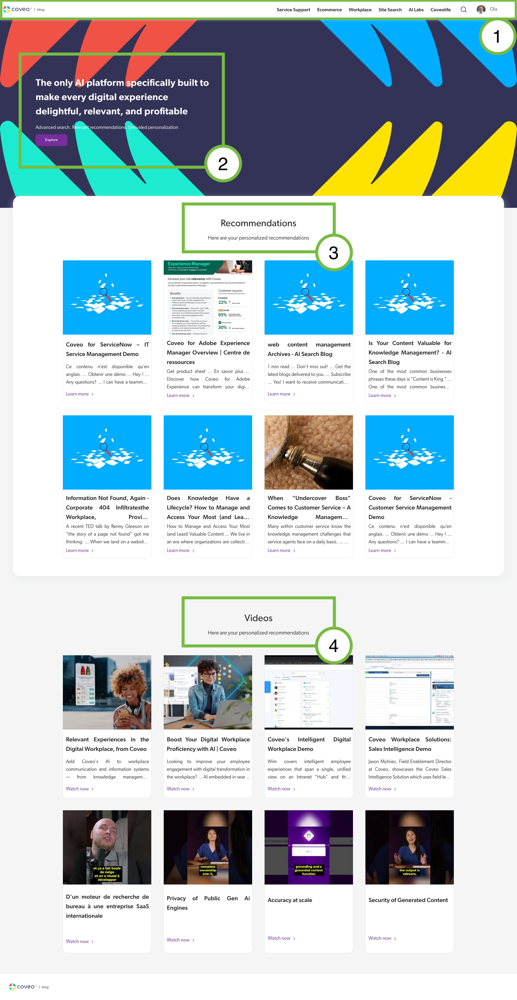
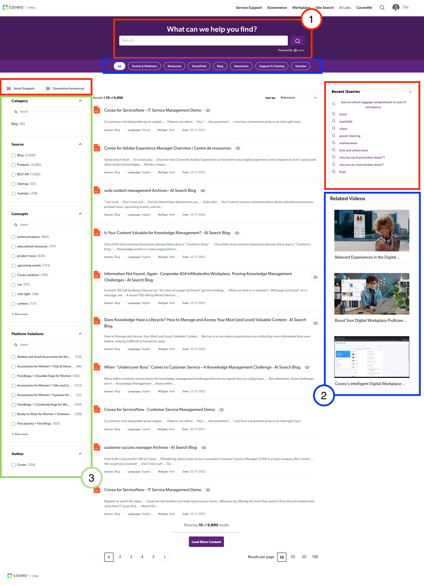

# Internationalization Configuration Setup

## Instructions
### How To Change The Base Language Settings
There are 3 Base Settings:
1. **InternationalizationEnables** - Boolean value that determines whether or not the functionality is enabled.
2. **DefaultLanguage** - The default and base language to be used.
    - This is the language that new users would start off on, however they are able to modify their locale via the dropdown.
3. **LanguagesConfig** - This is a dictionary of all the different supported languages, along with their flag to be rendered in the dropdown.
    - You can modify this config as you please, there is now limitation on which languages are put in here.
    - You just need to copy and paste the [flag](https://flagpedia.net/emoji) of your choosing into the config.

### Important Notes
- Please consult the [Locale Documentation](https://github.com/coveo/ui-kit/blob/master/packages/atomic/src/locales.json) to see which locales are supported.
- You are able to add additional abbreviated languages to each property, you don't need to put the same languages for all if there is no translation. As it stands the default for all text within GDE is english, you can overwrite this within each configuration (ie. if you want a different text to appear if english is selected) and you can add additional translations.
- Whenever you need to populate a language property, be sure to use the abbriviated locale as entering 'english' won't work.
- When code examples are presented throughout the documentation, they are just excerpts from the code for reference. Elements can be removed from configurations without causing errors.

<hr>

### How To Modify The Home Page
1. **HomeHeaderConfigTranslations**
    - Responsible for the top nav bar on the page.
    - The schema is there to change the displayed text for each item.
    - Every navigation link is presented by an object that contains a title property with nested language fields.
    - The name of each object is the same as the text in each navigation option (camelCased)
    - Text is rendered in this file -> [src/Components/HomePage/Header.tsx](./src/Components/HomePage/Header.tsx)
    ```json
        // Represents each navigation button
         "serviceSupport": {
            // The displayed text for each button
            "title": {
                // English translation would overwrite default text found in HTML
                "en": "Service Support",
                // Additional translation to support French
                "fr": "Service Assistance"
            }
        },
    ```
2. **HeroConfigTranslations**
    - Responsible for the main hero text displayed in the primary image of the view.
    - Encapsulates the title, descriptions and the button to explore more content.
    - Text is rendered in this file -> [src/Components/HomePage/HeroHome.tsx](./src/Components/HomePage/HeroHome.tsx)
    ```json
        "buttonText": {
            "fr": "Explorer"
        }
    ```
3. **HomeTopRecommendationConfigTranslations**
    - Small configuration for text fields that introduce the personalized recommendation. 
    - Text is rendered in this file -> [src/Components/Recommendations/HomeTopRecommendations.tsx](./src/Components/Recommendations/HomeTopRecommendations.tsx)
    ```json
        "title": {
            "fr": "Recommandations"
        },
    ```
4. **HomeBottomRecommendationConfigTranslations**
    - Small configuration for the text fields that introduce the personalized video recommendations.
    - Text is rendered in this file -> [src/Components/Recommendations/HomeBottomRecommendations.tsx](./src/Components/Recommendations/HomeBottomRecommendations.tsx)
    ```json
        "title": {
            "en": "Clips",
            "fr": "Vidéos"
        },
    ```
<br><br>



## How To Modify The Search Page
1. **SearchConfigTranslations**
    - Generic translations for the overall search page.
    - Each element is represented by its own object within the configuration.
    - Encompasses the search bar title at the top of the page, the recent queries tab on the right side of the page, the text for when no results are found, and the toggles for smart snippets and generative answering.
    - Text is rendered in these files -> [src/Components/SearchPage/NoResult.tsx](./src/Components/SearchPage/NoResult.tsx) and [src/Components/SearchPage/RecentQueriesList.tsx](src/Components/SearchPage/RecentQueriesList.tsx)
```json
    // Descriptive field representing element rendering the text.
    "searchBarTitle": {
        "fr": "Que pouvons-nous vous aider à trouver?",
    }
```
2. **SearchPageTabConfigTranslations**
    - Configuration that is responsible for the tabs within the search page.
    - Similar to other configurations, each outer object represents the different buttons to filter content.
    - Name of object must match the text entered in camel case format (ie. Shopping List => shoppingList, News & Announcements => newsAnnouncements)
    - Sidebar translations will have to be configured manually by the user since they are dynamically generated.
    - Text is rendered in this file -> [src/Components/SearchPage/SearchTabs.tsx](./src/Components/SearchPage/SearchTabs.tsx)
```json
    // Formatting example of each element
    // Name of tab "All"
    "all": {
        // Caption represents the text displayed on the button.
        "caption": {
            "fr": "Tout",
        }
    }
```
3. **FacetTranslations**
    - This configuration is purely dependent on the facets you have in your current setup.
    - Each field here typically will have to be entered by the user since facets aren't static and vary between demos.
    - Text is rendered in these files -> [src/Components/SearchPage/SearchPage.js](./src/Components/SearchPage/SearchPage.js) and [src/App.tsx](./src/App.tsx)
```json
    // The name of the facet 
    "source": {
        // The label of each facet
        "label": {
            "en": "Source"
        },
        // Optional field, doesn't need to be present in the object.
        // Translate individual results which is tailored to your data.
        "values": {
            "en": {},
            "fr": {
                "Products": "Produits"
            }
        }
    }
```
<br><br>



## Coveo Standard Translations
- At the end of the configuration file, there is a massive configuration for all the built in Atomic text.
- This isn't text that you have placed on the screen and is not dependent on your configuration.
- Examples of elements could include the button to 'load more results' or the search box placeholder text.
```json
    // Normally this field is rendered as 'Load More Results'
    // We can modify the original text for any supported language
    "load-more-results": {
        "en": "Load More Content"
    }
```

## Custom Usage
- If you want to render text that isn't already there, you can add a new object to any configuration or create a new one similar to the others dependent on your requirements.
- In order to connect to the translations you will need to use the getText() method 
```javascript
    // Expected Usage/Behaviour
    // ../InternationalizationConfig.tsx
    export const NewConfigTranslations = {
        "property": {
            // Translations
            "en": "This is an example"
        }
    }
```
- To then apply this translation to text in a given component
```JSX
    <p>{getText("This is the default text without translations", NewConfigTranslations, "property")}</p>
```
**getText()** - Responsible for displaying text dynamically on the client
- Parameters
    1. Default Text (String Value)
    2. Object/Configuration where given translations are stored (Object Value)
    3. The property for which we want to translate within the configuration (String Value)
- Method will try to retrieve a translation depedent on the selected language, if no corresponding property or translation is found, the default text will be displayed as a fail safe measure.


